# ChainBridge AI Agent Organization Map

## Overview

ChainBridge operates as a **distributed AI workforce** augmenting human decision-making across engineering, operations, product, and compliance functions. This document defines the organizational structure, responsibilities, and collaboration patterns of the 20 specialized AI agents and their human counterparts.

Each agent role maps to specific domains in the codebase and operates within clear boundaries to ensure coherent, secure, enterprise-grade platform development.

---

## AI Agent Registry

| # | Role | Type | Scope | Stage | Primary Domain |
|---|------|------|-------|-------|-----------------|
| 1 | **FRONTEND_SONNY** | AI-First | UI/UX | Current | `chainboard-ui/` |
| 2 | **BACKEND_CODY** | AI-First | APIs & Services | Current | `chainpay-service/`, `api/` |
| 3 | **CTO_BENSON** | Hybrid | Strategic Architecture | Current | Framework, ADRs |
| 4 | **DATA_ML_ENGINEER** | AI-First | ML Pipelines & Risk | Current | `chainiq-service/`, `models/` |
| 5 | **STAFF_ARCHITECT** | AI-First | Design & Coherence | Current | Canonical Models, Schemas |
| 6 | **BLOCKCHAIN_PROTOCOL_ENGINEER** | AI-First | Smart Contracts | Current | Blockchain Layer |
| 7 | **BLOCKCHAIN_INTEGRATION_ENGINEER** | AI-First | Off-Chain Bridge | Current | Web3 Integration |
| 8 | **BLOCKCHAIN_PRODUCT_LEAD** | Hybrid | Blockchain Strategy | Current | Settlement Product |
| 9 | **ML_PLATFORM_ENGINEER** | AI-First | ML Infrastructure | Near-Term | MLOps, Pipelines |
| 10 | **APPLIED_ML_SCIENTIST** | AI-First | Model Research | Near-Term | Experimentation, Backtests |
| 11 | **DATA_ENGINEER** | AI-First | Data Plumbing | Current | ETL, Data Quality |
| 12 | **EDI_SPECIALIST** | AI-First | Message Translation | Current | EDI Mapping (940/945/856) |
| 13 | **LOGISTICS_OPS_SME** | Hybrid | Domain Ground Truth | Hybrid | Operational Validation |
| 14 | **DEVOPS_SRE** | AI-First | Infrastructure & Uptime | Current | CI/CD, Monitoring |
| 15 | **SECURITY_COMPLIANCE_ENGINEER** | AI-First | Security Posture | Current | AuthN/Z, Compliance |
| 16 | **HEAD_OF_PRODUCT** | Human-First | Product Strategy | Current | Roadmap, Prioritization |
| 17 | **UX_PRODUCT_DESIGNER** | Hybrid | Operator-Centric Design | Current | Wireframes, Prototypes |
| 18 | **BIZDEV_PARTNERSHIPS_LEAD** | Human-First | Partnerships & BD | Near-Term | Integrations, Channels |
| 19 | **AI_AGENT_TIM** | AI-First | Agent Coordination | Scale-Up | Multi-Agent Orchestration |
| 20 | **AI_RESEARCH_BENSON** | AI-First | Advanced Research | Scale-Up | Novel Problems, Proofs |

---

## Organization Structure

```mermaid
flowchart TD
    Benson["CTO BENSON<br/>[Hybrid]<br/>Strategic Leadership"]

    subgraph Frontend["🎨 Frontend & UX"]
        Sonny["FRONTEND_SONNY [AI]<br/>ChainBoard UI"]
        Designer["UX_PRODUCT_DESIGNER [Hybrid]<br/>Operator Workflows"]
    end

    subgraph Backend["⚙️ Backend & Services"]
        Cody["BACKEND_CODY [AI]<br/>ChainPay Service"]
        DataEng["DATA_ENGINEER [AI]<br/>ETL & Pipelines"]
    end

    subgraph ML["🧠 AI & Machine Learning"]
        DataML["DATA_ML_ENGINEER [AI]<br/>ChainIQ Intelligence"]
        MLPlatform["ML_PLATFORM_ENGINEER [AI]<br/>MLOps Infrastructure"]
        MLScientist["APPLIED_ML_SCIENTIST [AI]<br/>Model Research"]
    end

    subgraph Blockchain["⛓️ Blockchain & Settlement"]
        BCProto["BLOCKCHAIN_PROTOCOL_ENGINEER [AI]<br/>Smart Contracts"]
        BCInteg["BLOCKCHAIN_INTEGRATION_ENGINEER [AI]<br/>Off-Chain Bridge"]
        BCProduct["BLOCKCHAIN_PRODUCT_LEAD [Hybrid]<br/>Settlement Strategy"]
    end

    subgraph Logistics["📦 Logistics & Compliance"]
        EDI["EDI_SPECIALIST [AI]<br/>Message Mapping"]
        LogOps["LOGISTICS_OPS_SME [Hybrid]<br/>Domain Expertise"]
    end

    subgraph Product["🎯 Product & Growth"]
        Head["HEAD_OF_PRODUCT [Human]<br/>Strategy & Roadmap"]
        BD["BIZDEV_PARTNERSHIPS_LEAD [Human]<br/>Partnerships"]
    end

    subgraph Infrastructure["🔒 Infrastructure & Reliability"]
        DevOps["DEVOPS_SRE [AI]<br/>CI/CD & Monitoring"]
        Security["SECURITY_COMPLIANCE_ENGINEER [AI]<br/>Security & Compliance"]
    end

    subgraph Architecture["🏗️ Architecture & Systems"]
        Architect["STAFF_ARCHITECT [AI]<br/>Coherence & Models"]
    end

    subgraph Research["🔬 Research & Innovation"]
        TimAgent["AI_AGENT_TIM [AI]<br/>Multi-Agent Coordination"]
        ResBenson["AI_RESEARCH_BENSON [AI]<br/>Advanced Research"]
    end

    Benson --> Frontend
    Benson --> Backend
    Benson --> ML
    Benson --> Blockchain
    Benson --> Logistics
    Benson --> Product
    Benson --> Infrastructure
    Benson --> Architecture
    Benson --> Research

    Sonny -.Coordinates.- Cody
    Sonny -.Coordinates.- Designer
    Cody -.Coordinates.- DataEng
    DataML -.Coordinates.- MLPlatform
    BCProto -.Coordinates.- BCInteg
    EDI -.Coordinates.- LogOps
    Head -.Coordinates.- Designer
    DevOps -.Coordinates.- Security

    style Benson fill:#ff6b6b,color:#fff
    style Sonny fill:#4ecdc4,color:#fff
    style Cody fill:#45b7d1,color:#fff
    style DataML fill:#96ceb4,color:#fff
    style BCProto fill:#ffeaa7,color:#000
    style Head fill:#dfe6e9,color:#000
```



---

## Collaboration Matrix

### Cross-Functional Workflows

#### Feature Implementation (Frontend ↔ Backend)

```
Sonny (Frontend) → Head of Product → Cody (Backend)

1. HEAD_OF_PRODUCT interviews operators, writes PRD
2. UX_PRODUCT_DESIGNER sketches workflows, validates with operators
3. FRONTEND_SONNY designs component hierarchy, API contracts
4. BACKEND_CODY implements endpoints, documents schemas
5. FRONTEND_SONNY integrates, tests end-to-end
6. DEVOPS_SRE deploys to staging, monitoring
7. SECURITY_COMPLIANCE_ENGINEER conducts security review
```

#### Risk Scoring Pipeline (ML ↔ Backend)

```
DATA_ML_ENGINEER → APPLIED_ML_SCIENTIST → ML_PLATFORM_ENGINEER → BACKEND_CODY

1. DATA_ML_ENGINEER designs model architecture
2. APPLIED_ML_SCIENTIST trains, backtests, validates
3. ML_PLATFORM_ENGINEER builds feature store, CI/CD
4. BACKEND_CODY integrates inference endpoint
5. DATA_ENGINEER maintains ETL pipeline
```

#### Settlement Flow (Blockchain ↔ Backend)

```
BLOCKCHAIN_PRODUCT_LEAD → BLOCKCHAIN_PROTOCOL_ENGINEER → BLOCKCHAIN_INTEGRATION_ENGINEER → BACKEND_CODY

1. BLOCKCHAIN_PRODUCT_LEAD defines settlement strategy
2. BLOCKCHAIN_PROTOCOL_ENGINEER designs smart contracts
3. BLOCKCHAIN_INTEGRATION_ENGINEER builds off-chain bridge
4. BACKEND_CODY orchestrates settlement execution
5. DEVOPS_SRE monitors blockchain health
```

---

## Stage Definitions

### Current (Production Ready)

Agents actively contributing to platform delivery. Fully staffed with clear domain expertise and proven collaboration patterns.

**Roles:** Sonny, Cody, Benson, Data/ML Engineer, Staff Architect, Blockchain Engineers (3), Data Engineer, EDI Specialist, Logistics SME, DevOps, Security, Head of Product, Designer

### Near-Term (Q1-Q2 Expansion)

Agents preparing for scale-up as platform matures. Planned for integration as specialized functions become critical.

**Roles:** ML Platform Engineer, Applied ML Scientist, BizDev Lead

### Scale-Up (Future)

Advanced coordination and research agents activated as multi-agent systems mature.

**Roles:** AI Agent Tim (multi-agent coordination), AI Research Benson (novel problem solving)

---

## Agent Type Definitions

### AI-First

An AI agent that operates autonomously within its domain, making decisions and implementing solutions with minimal human intervention. Human oversight is periodic and strategic.

**Examples:** FRONTEND_SONNY, BACKEND_CODY, DATA_ML_ENGINEER

**Characteristics:**
- Makes detailed implementation decisions
- Writes production code
- Conducts technical reviews
- Escalates only strategic decisions

### Hybrid

A role combining AI-driven execution with human expertise and judgment. AI agents provide analysis and proposals; humans make final decisions.

**Examples:** CTO_BENSON, UX_PRODUCT_DESIGNER, BLOCKCHAIN_PRODUCT_LEAD, LOGISTICS_OPS_SME

**Characteristics:**
- AI generates options, humans choose strategy
- AI executes within pre-approved boundaries
- Human domain expertise guides direction
- Regular decision checkpoints

### Human-First

A role primarily human-driven, with AI providing research, analysis, and execution support.

**Examples:** HEAD_OF_PRODUCT, BIZDEV_PARTNERSHIPS_LEAD

**Characteristics:**
- Humans own strategy and key decisions
- AI provides data, patterns, research
- Human judgment drives prioritization
- AI handles routine execution

---

## Key Integrations

### Agent Loader System

All agents are loaded dynamically from `AGENTS/<ROLE_NAME>/`:
- `system_prompt.md` — Role identity
- `onboarding_prompt.md` — Workflows
- `knowledge_scope.md` — Expertise boundaries
- `checklist.md` — Quick reference

### Agent Runtime

The `tools/agent_runtime.py` provides LLM-agnostic orchestration:
- Load any agent's prompts programmatically
- Prepare task context for LLM calls
- Validate agent configurations
- Export agents to JSON for tooling

### CI/CD Validation

`tools/agent_validate.py` ensures agent configs are always complete:
- Runs on every commit
- Validates all 4 files per agent
- Checks for empty prompts
- Fails the build if agents are incomplete

---

## Operational Guidelines

### When to Invoke Each Agent

- **FRONTEND_SONNY**: UI implementation, component design, operator workflows
- **BACKEND_CODY**: API design, database logic, service orchestration
- **DATA_ML_ENGINEER**: Risk scoring, anomaly detection, model training
- **BLOCKCHAIN_PROTOCOL_ENGINEER**: Smart contract logic, token mechanics
- **DEVOPS_SRE**: Infrastructure, CI/CD, monitoring, runbooks
- **SECURITY_COMPLIANCE_ENGINEER**: AuthN/Z, threat modeling, compliance readiness
- **HEAD_OF_PRODUCT**: Roadmap, feature prioritization, customer strategy
- **STAFF_ARCHITECT**: Schema design, ADRs, system coherence
- **CTO_BENSON**: High-level strategy, cross-team alignment, architectural decisions

### Communication Patterns

1. **Direct**: "Sonny, implement a filter UI for the control tower"
2. **Collaborative**: "Sonny + Cody, align on API contracts for settlement"
3. **Review**: "Benson, review this architecture decision"
4. **Research**: "Research Benson, investigate novel solutions for X"

---

## Success Metrics

- ✅ All agents operating within defined boundaries
- ✅ Cross-team coordination flowing smoothly
- ✅ Code quality consistent across all domains
- ✅ Security and compliance gates always passing
- ✅ Operator satisfaction with UX/workflows
- ✅ System performance meeting SLOs
- ✅ Rapid iteration without breaking changes

---

## See Also

- `AGENTS/README.md` — Full agent system description
- `COPILOT_SONNY_GUIDE.md` — Using Sonny in VS Code
- `tools/agent_runtime.py` — Agent framework runtime
- `tools/agent_validate.py` — Configuration validation
- `.github/workflows/agent_ci.yml` — Automated validation
