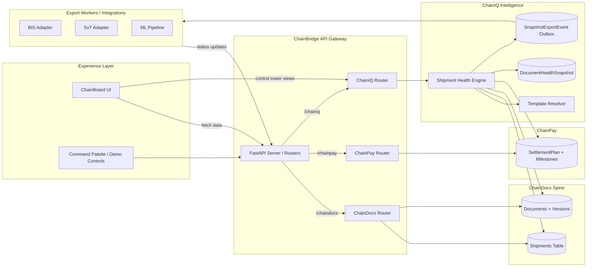

# ChainBridge Architecture

This diagram summarizes how the primary subsystems interact today. The flow highlights ChainBoard as the customer-facing surface, the unified API tier, and the downstream intelligence + payments stacks (ChainIQ, ChainDocs, ChainPay) sharing snapshots and export events for Control Tower visibility.

Use VS Code with “Markdown Preview Mermaid Support” (Cmd/Ctrl + Shift + V) or https://mermaid.live to render the diagram.
