# ChainBridge – Project Checklist & Progress Board

> **Doctrine:**
> Speed without proof gets blocked.
> Proof without pipes doesn't scale.
> Pipes without cash don't settle.
> **We build all three.**

**Last Updated:** November 19, 2025
**Current Status:** M01 Complete, M02 In Progress
**API Health:** ✅ Running on `:8001`
**Frontend:** ✅ Building & Connected

---

## 1. Milestones

| Milestone | Status | Key Deliverables | Target |
|-----------|--------|------------------|--------|
| **M01** – First Vertical Slice | ✅ COMPLETE | ChainIQ API running, ChainBoard UI integration, Snapshot export + Timeline | Done |
| **M02** – Live Risk & Worker Pipeline | 🔥 IN PROGRESS | Seed data, At-risk enrichment, Worker lifecycle, Real status transitions | Week 1 |
| **M03** – Payments and Proofs | ⬜ BLOCKED | ChainPay holds, ChainDocs timeline, ProofPack wiring | Week 2 |
| **M04** – Investor-Ready Control Tower | ⬜ BLOCKED | Full "Risk → Snapshot → Hold → Proof → Release" demo, Metrics, Auth | Week 3 |

---

## 2. Backend – ChainIQ / Core API (Cody)

### 2.1 ✅ Completed

- [x] **FastAPI Entrypoint**
  - `api/server.py` configured and running
  - Listening on `http://localhost:8001`

- [x] **Health Endpoint**
  - `GET /health` returns: `{"status": "healthy", "version": "...", "modules_loaded": ..., "active_pipelines": ..., "timestamp": "..."}`
  - Used by frontend APIHealthIndicator for connectivity checks

- [x] **At-Risk Shipments Endpoint (Base)**
  - `GET /chainiq/shipments/at_risk`
  - **Filters Supported:**
    - `max_results` (int, default: 50)
    - `min_risk_score` (float, 0–100)
    - `offset` (int, pagination)
    - `corridor_code` (string, e.g., "IN_US")
    - `mode` (string, e.g., "FCL")
    - `incoterm` (string, e.g., "CIF")
    - `risk_level` (string: LOW, MODERATE, HIGH)
  - Returns array of `AtRiskShipmentSummary` objects

- [x] **Snapshot Export Endpoints**
  - `POST /chainiq/admin/snapshot_exports` – Create export for shipment
    - Body: `{"shipment_id": "...", "include_related": true}`
    - Returns: `{"event_id": "...", "shipment_id": "...", "status": "PENDING", ...}`
  - `GET /chainiq/admin/snapshot_exports?shipment_id=...` – Fetch export history
    - Returns: Array of `SnapshotExportEvent` objects with status, timestamps, failure reasons, retry counts

- [x] **CORS Configuration**
  - Frontend on `localhost:5173` can communicate with API on `localhost:8001`
  - All routes accessible from ChainBoard UI

- [x] **Logging**
  - API logs piped to `/tmp/api.log` when running in background
  - Accessible via: `tail -f /tmp/api.log`

- [x] **Architecture Documentation**
  - `docs/architecture/architecture.md` created with Mermaid diagram
  - Data flow documented: ChainBoard → FastAPI → ChainIQ/ChainPay/ChainDocs

- [x] **M03 – ChainPay PaymentIntent Backbone**
  - Auto-create PaymentIntents on ChainIQ LOW/MEDIUM risk approvals, linked to latest snapshot id
  - Proof attachment validated against ChainDocs with 404/503 handling + 409 conflict guard
  - Operator-ready list filters (`has_proof`, `ready_for_payment`) and KPI summary counts
- [x] **DB Migrations (Alembic)**
  - Alembic initialized with baseline + constraints revisions for PaymentIntent/SettlementEvent
  - Partial uniqueness on active PaymentIntents and indexes for settlement timelines
  - Backfill helper for `latest_risk_snapshot_id`
- [x] **Settlement Core v2**
  - Pricing breakdown on PaymentIntents with rate card/fuel/accessorial/volatility components
  - Webhook orchestrator stubs append settlement events and publish bus events
  - Event bus v1 in-process; SLA endpoints for operator freshness metrics
- [x] **ChainAudit v1**
  - Reconciliation helper writes payout_confidence/auto_adjusted_amount/explanation to PaymentIntents
  - `POST /audit/payment_intents/{id}/reconcile` + GET reader; emits RECONCILED settlement event + bus event
- [x] **ChainStake v1 (stub)**
  - Stake jobs table + service + `/stake` routes (create/list/get) with auto-complete and stake events
- [x] **ChainDocs Hashing v1**
  - Documents store sha256/storage metadata; PaymentIntent carries proof_hash; `/chaindocs/documents/{id}/verify` validates integrity

### 2.2 🔥 In Progress / Next (M02 Phase)

#### 2.2.1 Seed Realistic At-Risk Data
- [ ] **Create:** `scripts/seed_chainiq_demo.py`
  - [ ] Generates 20–50 demo shipments with realistic attributes
  - [ ] Attributes: `shipment_id`, `corridor_code`, `mode`, `incoterm`, `risk_score`, `risk_level`, `origin`, `destination`, `eta_days`, `status`
  - [ ] Idempotent – safe to re-run without duplicates
  - [ ] Uses `INSERT ... ON CONFLICT` or similar pattern
  - [ ] Timestamps reflect realistic historical data

- [ ] **Usage Documentation**
  - [ ] Add to `README.md`: `python -m scripts.seed_chainiq_demo [--clear] [--count=50]`
  - [ ] `--clear` flag to wipe demo data before re-seeding
  - [ ] Show output: "✅ Seeded N demo shipments"

- [ ] **Verification Script** (Optional)
  - [ ] `scripts/verify_seed.py` to confirm data was inserted correctly
  - [ ] Query at-risk endpoint and display summary stats

#### 2.2.2 At-Risk Enrichment with Latest Snapshot Status
- [ ] **Enrich Response**
  - [ ] Add to each `AtRiskShipmentSummary`:
    - `latest_snapshot_status`: "SUCCESS" | "FAILED" | "IN_PROGRESS" | "PENDING" | null
    - `latest_snapshot_updated_at`: ISO timestamp or null
  - [ ] Single query with LEFT JOIN or subquery (no N+1)

- [ ] **Implementation**
  - [ ] Update `get_at_risk_shipments()` in `routes/chainiq.py` or equivalent
  - [ ] Test with N shipments to verify no N+1 queries

- [ ] **Frontend Integration** (Already wired in ShipmentRiskTable.tsx)
  - [x] Column already displays snapshot status badge
  - [ ] Update types if needed: `AtRiskShipmentSummary` interface

- [ ] **Tests**
  - [ ] `tests/test_chainiq_api.py` – Test enrichment response schema
  - [ ] Verify null handling when no snapshots exist
  - [ ] Verify correct latest snapshot is returned

#### 2.2.3 Snapshot Worker Lifecycle
- [ ] **Worker Service Methods** (in `api/services/snapshot_worker.py` or equivalent)
  - [ ] `claim_next_pending_event(worker_id: str) -> SnapshotExportEvent | None`
    - Updates event `status = "IN_PROGRESS"`, `claimed_by = worker_id`
    - Concurrency-safe (database lock or atomic update)
  - [ ] `mark_event_success(event_id: str) -> SnapshotExportEvent`
    - Updates event `status = "SUCCESS"`, `completed_at = now`
  - [ ] `mark_event_failed(event_id: str, reason: str, retryable: bool) -> SnapshotExportEvent`
    - Updates event `status = "FAILED"`, `failure_reason = reason`
    - If `retryable=True`: increment `retry_count`; if < `MAX_EXPORT_RETRIES`, reset to "PENDING"
    - If `retryable=False` or max retries exceeded: mark "FAILED" permanently

- [ ] **State Machine**
  - [ ] Enforce transitions: `PENDING → IN_PROGRESS → SUCCESS/FAILED`
  - [ ] Prevent invalid transitions (e.g., SUCCESS → IN_PROGRESS)
  - [ ] Validation in database constraints or service layer

- [ ] **Retry Logic**
  - [ ] `MAX_EXPORT_RETRIES` constant (recommend: 3)
  - [ ] Retry only if `retryable=True`
  - [ ] On retry, reset `status = "PENDING"` and `claimed_by = null`

- [ ] **Concurrency Safety**
  - [ ] Use database-level row locking (e.g., `SELECT ... FOR UPDATE`)
  - [ ] Or use optimistic locking with version field
  - [ ] Test concurrent claims: no two workers should claim same event

- [ ] **Tests** (in `tests/test_snapshot_worker.py`)
  - [ ] Test claim → in-progress → success flow
  - [ ] Test claim → in-progress → failed → retry flow
  - [ ] Test max retries exceeded (mark failed permanently)
  - [ ] Test concurrent claims (only one worker claims event)
  - [ ] Test state machine violations

#### 2.2.4 Worker Runner Script
- [ ] **Create:** `scripts/run_snapshot_worker.py`
  - [ ] Infinite loop with configurable sleep interval (default: 2s)
  - [ ] Each iteration:
    1. Call `claim_next_pending_event(worker_id=<hostname>)`
    2. If event claimed:
       - Simulate processing (sleep 1–3 seconds)
       - Randomly succeed or fail (80% success, 20% failure for demo)
       - Call `mark_event_success()` or `mark_event_failed()`
    3. If no event, sleep and retry

- [ ] **Signal Handling**
  - [ ] Graceful shutdown on SIGTERM / Ctrl+C
  - [ ] Print status: events processed, success rate, last error

- [ ] **Logging**
  - [ ] Log each claim, process, and result
  - [ ] Use Python `logging` module; target `/tmp/snapshot_worker.log`

- [ ] **Usage Documentation**
  - [ ] Add to `README.md`: `python -m scripts.run_snapshot_worker [--worker-id=<id>] [--interval=2]`
  - [ ] Show example: `python -m scripts.run_snapshot_worker --worker-id=worker-001 --interval=2`

- [ ] **Background Startup** (Optional)
  - [ ] Add to `launch_enterprise.sh` or similar: `python -m scripts.run_snapshot_worker &`
  - [ ] Log to background file

---

## 3. Frontend – ChainBoard UI (Sonny)

### 3.1 ✅ Completed

- [x] **API Base URL Configuration**
  - Configured to `http://localhost:8001`
  - Frontend builds and runs on `http://localhost:5173`

- [x] **Fleet Cockpit Table** (`ShipmentRiskTable.tsx`)
  - **Columns:**
    - Shipment ID (clickable)
    - Corridor Code (formatted: "IN → US")
    - Mode (FCL, LCL, etc.)
    - Incoterm (CIF, FOB, etc.)
    - Risk Score (0–100)
    - Risk Level (Low/Moderate/High with color coding)
    - ETA Days
    - Snapshot Status (badge: Exported, Exporting, Failed, —)
    - Actions (Timeline button, Export button)
  - **Filtering:**
    - Min Risk Score slider
    - Corridor Code select
    - Mode multi-select
    - Incoterm multi-select
    - Risk Level buttons (All, Critical, High, Moderate, Low) – **partially implemented**
  - **Pagination:**
    - 10, 25, 50 rows per page
    - Next/Previous buttons
  - **Responsive Design:**
    - Works on desktop and tablet
    - Scrollable on mobile

- [x] **Snapshot Export Action**
  - Export button wired to `POST /chainiq/admin/snapshot_exports`
  - Button disables and shows spinner on click
  - Prevents duplicate exports (disable if already exporting)
  - Success toast notification

- [x] **Auto-Polling (Table)**
  - `useAtRiskShipments` hook with React Query `refetchInterval: 15_000`
  - Respects active filters and pagination
  - Shows loading skeleton while fetching

- [x] **Snapshot Timeline Drawer** (`SnapshotTimelineDrawer.tsx`)
  - **Layout:**
    - Right-side drawer, closes on backdrop click or Escape key
    - Smooth slide-in/slide-out animation
  - **Timeline Display:**
    - Vertical timeline with event dots
    - Status icon per event (check, X, clock)
    - Connected by vertical line
  - **Event Details (per TimelineItem):**
    - Status badge (colored: green=success, red=failed, yellow=pending)
    - Absolute timestamp + relative time (e.g., "2h ago")
    - Event ID (truncated)
    - Worker ID (claimed_by)
    - Retry count
    - Failure reason (if failed, displayed in red box with icon)
  - **Auto-Polling:**
    - Refetches every 5 seconds while drawer is open
    - Stops polling when drawer closes

- [x] **API Health Indicator** (`APIHealthIndicator.tsx`)
  - **Visual Indicator:**
    - Green badge: "API Healthy"
    - Yellow badge: "Checking..."
    - Red badge: "API Down"
  - **Poll Interval:** 45 seconds
  - **Tooltip:** Shows version, modules loaded, active pipelines, last check time
  - **Location:** Top-right corner or header area

- [x] **Build Success**
  - `npm run build` passes without errors
  - TypeScript strict mode enabled

### 3.2 🔥 In Progress / Next (M02 Phase)

#### 3.2.1 Rich Empty States

- [ ] **Cockpit Empty State**
  - [ ] When `data` is empty array, show centered message:
    - "No at-risk shipments found"
    - "Try adjusting filters or load demo data"
    - "Load Demo Data" button (calls optional `onLoadDemoData` callback)
  - [ ] Visual: icon + text + action

- [ ] **Timeline Drawer Empty State**
  - [ ] When no export events exist for shipment, show:
    - "No exports yet"
    - "Click Export Snapshot to start"
  - [ ] Visual: clock icon + text

#### 3.2.2 Risk-Level Filter Pills

- [ ] **UI Component**
  - [ ] Horizontal pill bar: "All" | "Critical" | "High" | "Moderate" | "Low"
  - [ ] Selected pill highlighted
  - [ ] Clicking pill:
    - Updates `risk_level` filter
    - Resets pagination to page 1
    - Triggers refetch

- [ ] **Integration with ShipmentRiskTable**
  - [ ] Pass `selectedRiskLevel` and `onRiskLevelChange` props
  - [ ] Render above table filters or inline with other controls

#### 3.2.3 Timeline Grouping & Polish

- [ ] **Group Events by Day**
  - [ ] Sticky date header above events from same day
  - [ ] Header format: "Today" | "Yesterday" | "Nov 18, 2025"

- [ ] **Event Display Improvements**
  - [ ] Absolute time format: `Mon, Nov 19, 02:34 PM`
  - [ ] Relative time: "5 minutes ago" in light badge
  - [ ] Smooth scroll behavior
  - [ ] Better spacing for desktop/tablet

#### 3.2.4 Loading & Error States

- [ ] **Skeleton Loaders**
  - [ ] Drawer loading state: skeleton timeline
  - [ ] Table loading state: skeleton rows (already implemented)

- [ ] **Error Handling**
  - [ ] Network error in Timeline Drawer: show retry button
  - [ ] Network error in Cockpit: show alert with retry

---

## 4. Integration & E2E Flows

### 4.1 ✅ Completed

- [x] **Backend ↔ Frontend Communication**
  - [x] API CORS configured for `localhost:5173`
  - [x] All endpoints reachable from UI

- [x] **Snapshot Export Flow (E2E)**
  1. ✅ User clicks "Export" button on at-risk shipment
  2. ✅ Frontend calls `POST /chainiq/admin/snapshot_exports`
  3. ✅ Backend creates `SnapshotExportEvent` with status "PENDING"
  4. ✅ Button disables, spinner shows
  5. ✅ Frontend polls table to see snapshot status update
  6. ✅ User clicks Timeline button to view event history
  7. ✅ Timeline drawer opens, shows export event

### 4.2 🔥 In Progress / Next

- [ ] **Full Worker-Driven Flow**
  1. Backend seeds at-risk data → endpoint returns enriched data with latest snapshot
  2. User exports snapshot → event created with "PENDING" status
  3. Worker claims event → status becomes "IN_PROGRESS"
  4. Worker simulates processing → status becomes "SUCCESS" or "FAILED"
  5. Timeline drawer shows real status transitions
  6. Table updates to reflect latest snapshot status

- [ ] **Seed + Demo Command Bundle**
  - [ ] Single bash script: `./start_demo.sh`
    1. Start API in background
    2. Run seed script
    3. Start worker in background
    4. Start UI dev server
    5. Open browser to ChainBoard
    6. Display "✅ Demo ready" message with URLs

---

## 5. Documentation & Infra

### 5.1 ✅ Completed

- [x] **M01 Milestone Documentation**
  - [x] `MILESTONE_01_VERTICAL_SLICE.md` – comprehensive vertical slice report
  - [x] `QUICK_START_M01.md` – 30-second startup guide

- [x] **Architecture Documentation**
  - [x] `docs/architecture/architecture.md` with Mermaid diagram

- [x] **README Updates**
  - [x] API base URL configured
  - [x] Build command documented

### 5.2 🔥 In Progress / Next

- [ ] **M02 Milestone Documentation**
  - [ ] `MILESTONE_02_LIVE_PIPELINE.md` after M02 completion
  - [ ] Includes: enrichment, worker lifecycle, real timeline, seed data

- [ ] **Worker Setup Documentation**
  - [ ] Instructions for `scripts/seed_chainiq_demo.py`
  - [ ] Instructions for `scripts/run_snapshot_worker.py`
  - [ ] Troubleshooting section

- [ ] **Updated README.md**
  - [ ] Add: "Quick Start with Demo Data" section
  - [ ] Link to M02 documentation
  - [ ] Seed command examples
  - [ ] Worker runner examples

---

## 6. Visual Progress Overview (Mermaid)

```mermaid
flowchart TD

    subgraph DONE["🟩 Completed (M01)"]
        D1["API up on :8001"]
        D2["Health endpoint + indicator"]
        D3["At-risk shipments endpoint"]
        D4["Snapshot export endpoints"]
        D5["ChainBoard UI connected"]
        D6["Fleet Cockpit table + filters"]
        D7["Snapshot export button"]
        D8["SnapshotTimelineDrawer v1"]
        D9["Auto-polling (15s + 5s)"]
        D10["Architecture docs"]
    end

    subgraph ACTIVE["⚡ In Progress (M02)"]
        A1["Seed demo at-risk data"]
        A2["At-risk enrichment w/ snapshot status"]
        A3["Snapshot worker lifecycle"]
        A4["Retry logic & concurrency safety"]
        A5["Worker runner script"]
        A6["Empty states & demo CTA"]
        A7["Risk-level filter pills"]
        A8["Timeline event grouping by day"]
    end

    subgraph NEXT["⬜ Upcoming (M03+)"]
        N1["ChainPay payment holds"]
        N2["ChainDocs doc timeline"]
        N3["ProofPack wiring"]
        N4["Observability & metrics"]
        N5["Demo bundle script"]
        N6["M02/M03 milestone docs"]
    end

    DONE --> ACTIVE --> NEXT

```



---

## 7. Known Limitations & Blockers

### Current (M01)

- **Demo Data:** At-risk endpoint returns no data (needs seeding) – blocking visual demos
- **Worker:** No background worker processing; manual export creation only
- **Timeline:** Simple chronological list, no grouping by date or advanced filtering

### Blocking M03 Start

- **Payment Integration:** Awaiting ChainPay API schema definition
- **Document Integration:** Awaiting ChainDocs API schema definition
- **ProofPack:** Awaiting proof format specification

---

## 8. Success Criteria (By Milestone)

### M01 (✅ DONE)

- [x] API running and responding to `/health`
- [x] Frontend can fetch at-risk shipments (even if empty)
- [x] Export button creates snapshot event
- [x] Timeline drawer displays export events with status
- [x] Architecture documented

### M02 (🔥 IN PROGRESS)

- [ ] 20–50 demo shipments seeded and visible in table
- [ ] At-risk endpoint returns latest snapshot status per shipment
- [ ] Worker claims, processes, and marks events
- [ ] Timeline shows real status transitions (PENDING → IN_PROGRESS → SUCCESS/FAILED)
- [ ] Retry logic tested and working
- [ ] Worker runner script operational
- [ ] Documentation complete

### M03 (⬜ BLOCKED)

- [ ] Payment holds created and visible in UI
- [ ] Document timeline integrated with proof flow
- [ ] ProofPack wired into export flow
- [ ] Full "Risk → Snapshot → Hold → Proof" demo operational

### M04 (⬜ BLOCKED)

- [ ] Investor-ready dashboard with full flow
- [ ] Observability and metrics
- [ ] Basic authentication
- [ ] All systems integrated and demo-ready

---

## 9. Ownership & Contacts

| Component | Owner | Status |
|-----------|-------|--------|
| ChainIQ API / Backend | Cody | ✅ M01 Complete, 🔥 M02 In Progress |
| ChainBoard UI / Frontend | Sonny | ✅ M01 Complete, 🔥 M02 In Progress |
| Database / Seeding | Cody | ⬜ M02 In Progress |
| Worker Pipeline | Cody | 🔥 M02 In Progress |
| ChainPay Integration | TBD | ⬜ M03 Blocked |
| ChainDocs Integration | TBD | ⬜ M03 Blocked |
| Observability | DevOps | ⬜ M04 Blocked |

---

## 10. Quick Reference – Commands

### Development Environment

```bash
# Start API backend
cd /path/to/ChainBridge
source .venv/bin/activate
python -m api.server

# Start frontend dev server
cd chainboard-ui
npm run dev

# View API logs
tail -f /tmp/api.log

# Seed demo data (once implemented)
python -m scripts.seed_chainiq_demo --count=50

# Start snapshot worker (once implemented)
python -m scripts.run_snapshot_worker --worker-id=local-worker --interval=2
```

### API Endpoints (Reference)

```bash
# Health check
curl http://127.0.0.1:8001/health | jq

# At-risk shipments (base – no data until seeded)
curl "http://127.0.0.1:8001/chainiq/shipments/at_risk?max_results=10" | jq

# Create snapshot export
curl -X POST http://127.0.0.1:8001/chainiq/admin/snapshot_exports \
  -H "Content-Type: application/json" \
  -d '{"shipment_id": "SHP-001", "include_related": true}' | jq

# Fetch export history for shipment
curl "http://127.0.0.1:8001/chainiq/admin/snapshot_exports?shipment_id=SHP-001" | jq
```

### UI Endpoints

```
Cockpit: http://localhost:5173
API Health: Visible in top-right
Timeline Drawer: Click shipment row → click Timeline icon
```

---

## 11. Notes & Decisions Log

- **Polling Intervals:** 15s for table, 5s for drawer – balanced between responsiveness and server load
- **API Health Poll:** 45s to avoid excessive checks; uses browser cache
- **Worker Retry:** 3 max retries before giving up; configurable via constant
- **Risk-Level Pills:** Integrated with existing filter system; resets pagination for UX clarity
- **Demo Data:** Will be inserted at application startup (idempotent) or via explicit seed command

---

**Next Action:** Begin M02 implementation with seed data script creation.

- [x] **Settlement Core v2 (Operator-facing)**
  - Operator queue/risk snapshot/settlement events endpoints exposed
  - In-process event bus and webhook stubs for settlement + proof attached
  - SLA endpoints for operator health and queue metrics
- [x] **Operator Console data surfaces**
  - OC queue, risk snapshot, settlement events, IoT health, and operator event stream exposed under /operator
- [x] **Operator Events & IoT**
  - Added /operator/events/stream and /operator/iot/health/summary endpoints with mocks/backed by settlement events
