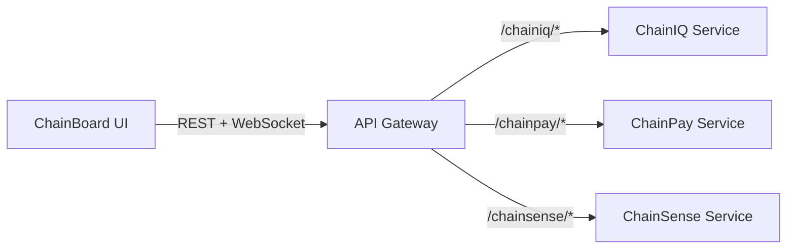

# Operator Console (ChainBoard) Overview

## Why It Matters

The Operator Console is the face of ChainBridge. It gives shippers and 3PL operators a live Control Tower view across shipments, risk, payments, and IoT telemetry. Every enterprise demo starts here—if ChainBoard feels polished, the entire platform feels production-ready.

## What It Delivers

- **Global Health Snapshot:** Corridor metrics, risk categorisation, and live shipment status.
- **Exception Management:** Prioritised queues with playbooks for ops teams.
- **Settlement Visibility:** ChainPay milestones and cash flow dashboards surfaced inline.
- **Intelligence Feeds:** ChainIQ insights, IoT pulse, and future ChainSense anomaly alerts.

## Code Location

- UI source: `services/chainboard-service/`
- Shared UI utilities: `platform/common-lib/ui/` (coming online as components are shared)
- Backend dependency: `services/api-gateway/` (all API calls go through `VITE_API_BASE_URL`)

## How It Connects



## Local Development

1. Start the API stack:
   ```bash
   ./scripts/dev/run_api_gateway.sh
   ```
2. In a new terminal, run the UI:
   ```bash
   ./scripts/dev/run_chainboard.sh
   ```
3. Visit `http://localhost:5173`.

Both scripts auto-install dependencies if needed. Override the backend target by setting `VITE_API_BASE_URL` in `services/chainboard-service/.env.local`.

## Demo Hooks

- Guided demos live in `scripts/demo/` (see `scripts/demo/control_tower_walkthrough.md`).
- Sample data packs reside in `platform/proofpack/chainboard/*.json`.

## Next Steps

- Finish migrating shared UI primitives into `platform/common-lib/ui`.
- Add telemetry dashboards once ChainSense streams are live.
- Coordinate with DX to keep VS Code tasks (`Start ChainBoard UI`) in sync with scripts.
