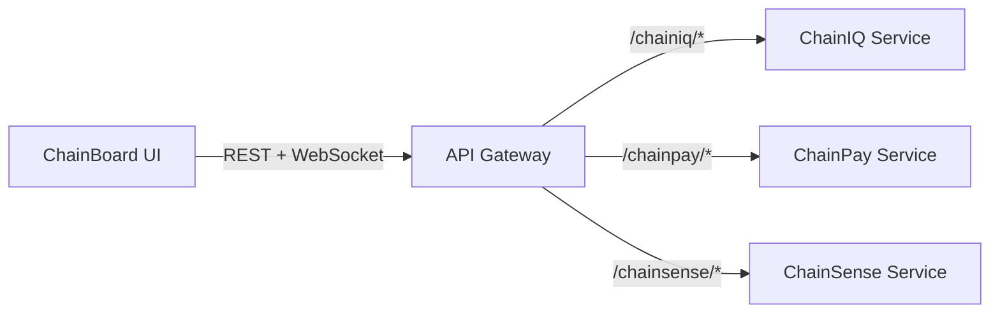

# Operator Console (ChainBoard) Overview

## Why It Matters

The Operator Console is the face of ChainBridge. It gives shippers and 3PL operators a live Control Tower view across shipments, risk, payments, and IoT telemetry. Every enterprise demo starts here—if ChainBoard feels polished, the entire platform feels production-ready.

## What It Delivers

- **Global Health Snapshot:** Corridor metrics, risk categorisation, and live shipment status.
- **Exception Management:** Prioritised queues with playbooks for ops teams.
- **Settlement Visibility:** ChainPay milestones and cash flow dashboards surfaced inline.
- **Intelligence Feeds:** ChainIQ insights, IoT pulse, and future ChainSense anomaly alerts.

## Code Location

- Frontend (ChainBoard / OC): `chainboard-ui/`
- Backend API & services: `api/`, `chainiq-service/`, `chainpay-service/`

## How It Connects



## Local Development

1. Start the FastAPI backend (see root `README.md` for `api/server.py`).
2. In a new terminal, run the UI from `chainboard-ui/`:
   ```bash
   npm run dev
   ```
3. Visit `http://localhost:5173` (with `VITE_API_BASE_URL` pointing at `http://localhost:8001`).

## Demo Hooks

- Guided demos live in `scripts/demo/` (see `scripts/demo/control_tower_walkthrough.md`).
-- Sample data packs and demo scripts live under `scripts/` and `sample_data/`.

## Next Steps

- Finish migrating shared UI primitives into `platform/common-lib/ui`.
- Add telemetry dashboards once ChainSense streams are live.
-- Coordinate with DX to keep VS Code tasks (`Start ChainBoard UI`) in sync with scripts.

## Where to Go in the Repo

- Backend services: `api/`, `chainiq-service/`, `chainpay-service/`
- Frontend (ChainBoard / OC): `chainboard-ui/`
- Agent framework: `AGENTS 2/`
- Architecture diagrams: `docs/architecture/`
